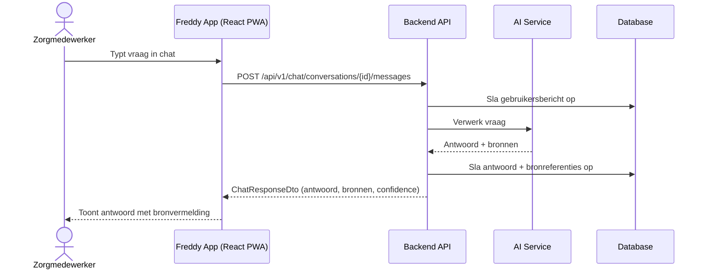
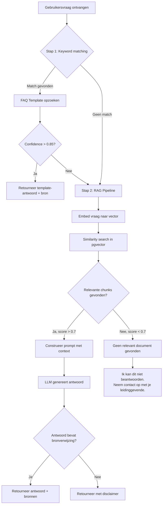
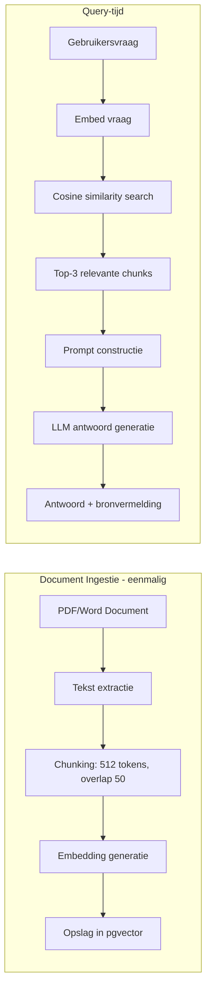
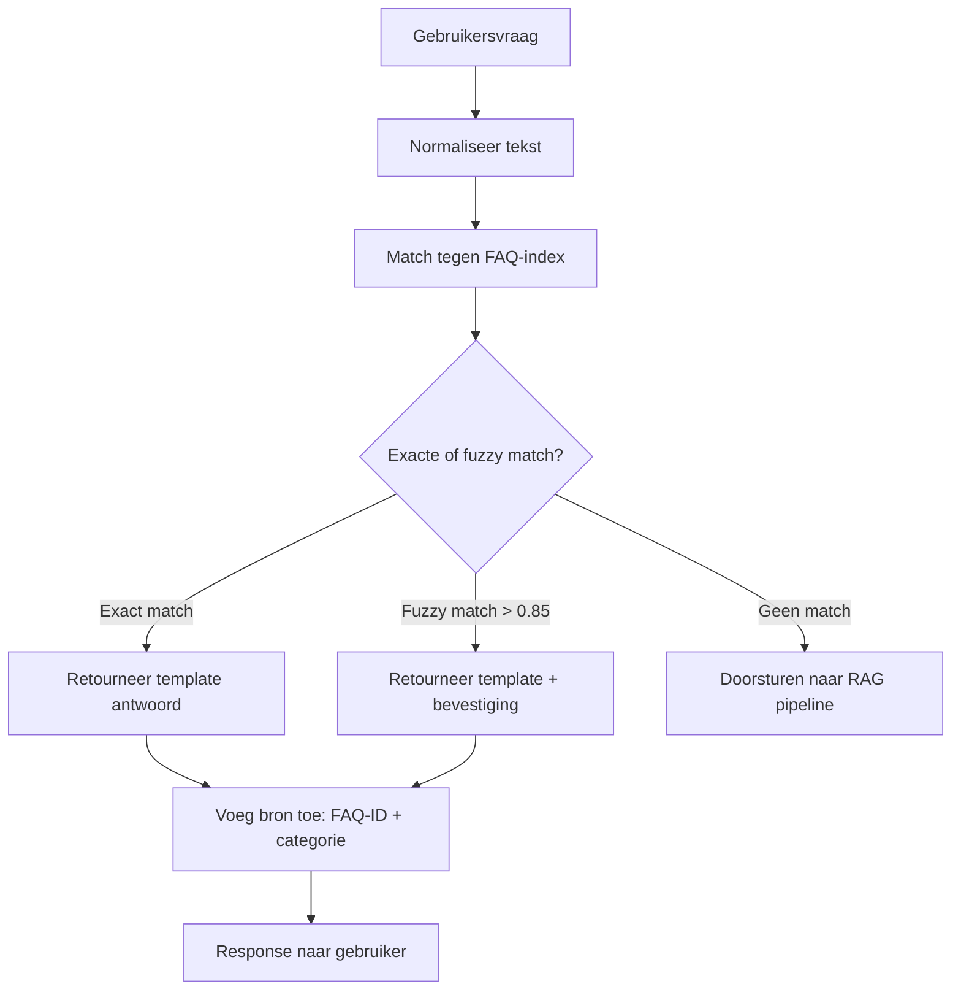
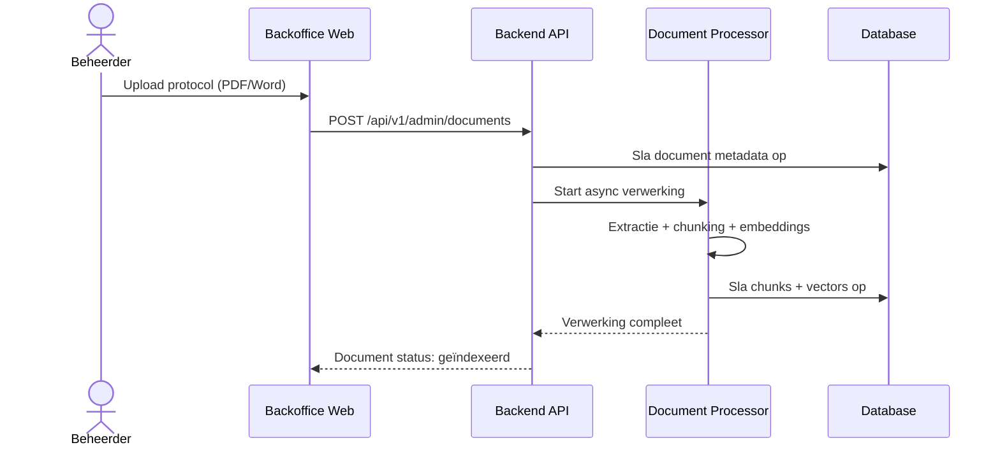

## Functionele Architectuur

### Chat Flow

### Intent Detection Flow

### Document Retrieval Flow (RAG)

### Standaard Antwoord Flow (FAQ/Templates)

### Admin Upload Flow (Fase 3 — Toekomst)

