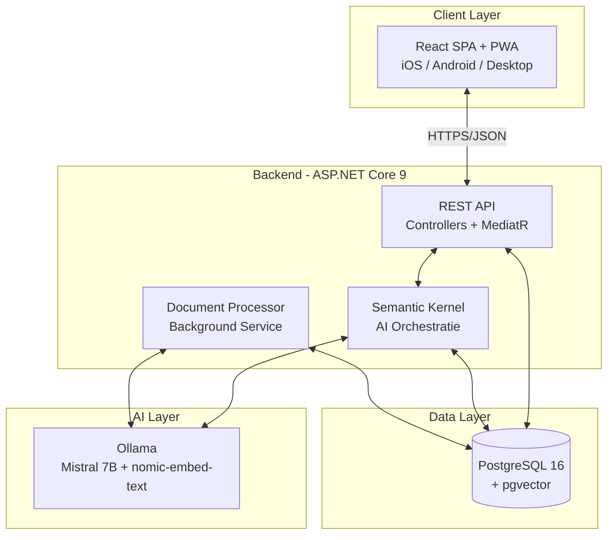
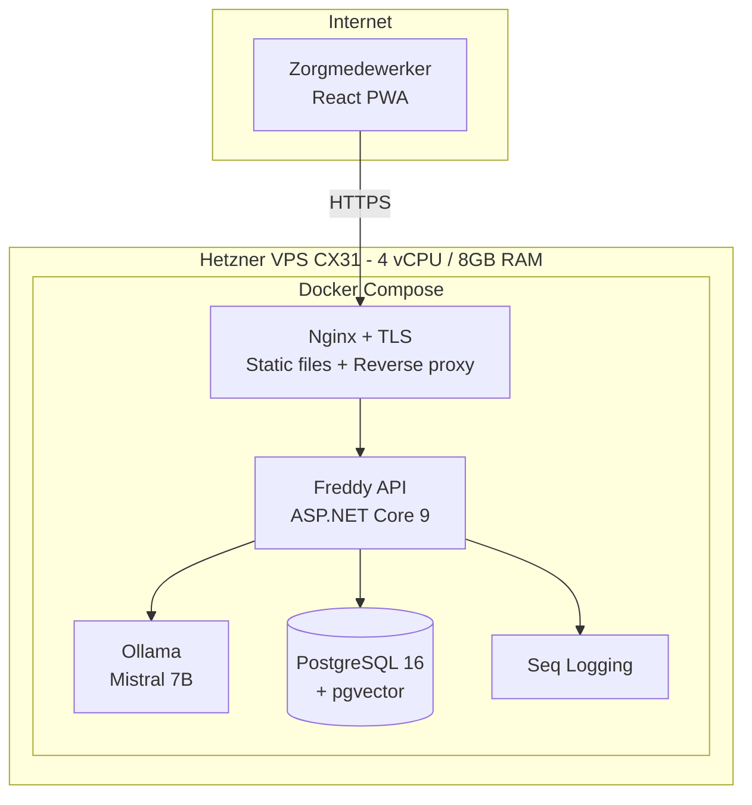

## Technische Architectuur

### High-Level Architectuur



### Backend (.NET)

**Architectuurstijl:** Pragmatische Clean Architecture (3-laags)

```
Freddy.sln
├── src/
│   ├── Freddy.Api/              # Presentation: controllers, middleware
│   ├── Freddy.Application/      # Business logic: CQRS handlers, AI orchestration
│   └── Freddy.Infrastructure/   # External: EF Core, Ollama, services
├── apps/
│   └── Freddy.Web/              # React 19 + Vite + TypeScript SPA (PWA)
└── tests/
```

**Monolith vs Microservices**: Modular Monolith. Eén deployable, maar met duidelijke
module-grenzen (Chat, Documents, AI) die later als service kunnen afsplitsen.

### API Ontwerp

| Endpoint | Methode | Beschrijving | MVP |
|----------|---------|-------------|-----|
| `/api/v1/chat/conversations` | GET | Lijst conversaties | ✅ |
| `/api/v1/chat/conversations` | POST | Nieuwe conversatie | ✅ |
| `/api/v1/chat/conversations/{id}/messages` | GET | Berichten ophalen | ✅ |
| `/api/v1/chat/conversations/{id}/messages` | POST | Bericht sturen (trigger AI) | ✅ |
| `/api/v1/auth/login` | POST | Authenticatie | ✅ |
| `/api/v1/auth/refresh` | POST | Token refresh | ✅ |
| `/api/v1/documents` | GET | Protocollen lijst | ✅ |
| `/api/v1/documents/{id}` | GET | Document details | ✅ |
| `/api/v1/admin/documents` | POST | Upload document | Fase 3 |
| `/api/v1/admin/faq` | CRUD | FAQ beheer | Fase 3 |

### Patterns

| Pattern | Toepassing | Reden |
|---------|-----------|-------|
| CQRS | Alle use cases | Scheiding read/write |
| MediatR | Command/Query dispatch | Loose coupling, pipeline behaviors |
| Result Pattern | Handler return types | Geen exceptions voor flow control |
| Options Pattern | Configuratie | Strongly-typed settings |
| Background Service | Document processing | Non-blocking ingestie |

### Database: PostgreSQL 16 + pgvector

Eén database voor zowel applicatiedata als vectoropslag. Geen extra services.
pgvector is ruim voldoende voor 20-200 documenten (~20.000 chunks).
Bij 100.000+ chunks kan Qdrant worden overwogen.

### Frontend & Mobile

**Fase 1 (MVP):** React 19 + TypeScript + Vite SPA met PWA (vite-plugin-pwa) — installeerbaar via browser, geen App Store nodig.
**Fase 2:** PWA behouden of optioneel React Native (Expo) voor App Store publicatie.
**Fase 3:** React-gebaseerd backoffice, hergebruik van componenten uit de SPA.

### Deployment Architectuur



### Geschatte Kosten

| Component | Kosten/maand |
|-----------|-------------|
| Hetzner VPS CX31 | ~€12 |
| Backup + domein | ~€3 |
| Alle software (open source) | €0 |
| **Totaal** | **~€15/maand** |
