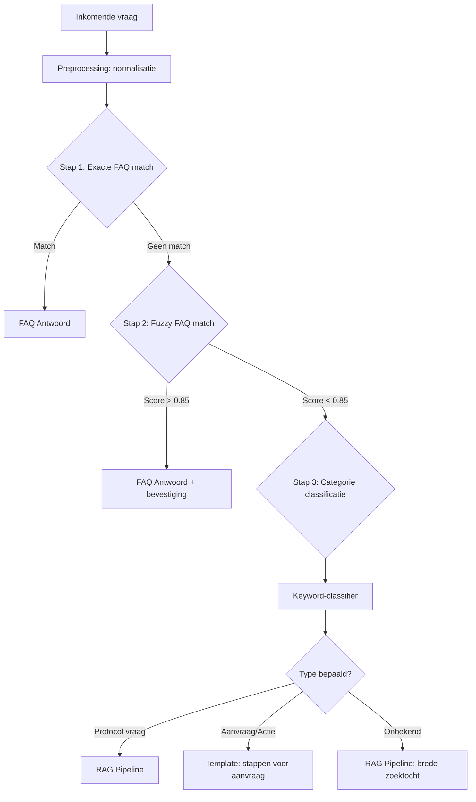
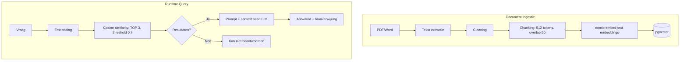

## AI Architectuur Deep Dive

### Intent Detection

**Gelaagde aanpak** (goedkoopst eerst):

| Stap | Methode | LLM nodig? | Latency |
|------|---------|-----------|---------|
| 1 | Exacte FAQ keyword match | Nee | <10ms |
| 2 | Fuzzy string matching | Nee | <20ms |
| 3 | Keyword categorie classifier | Nee | <10ms |
| 4 | RAG: vector search + LLM | Ja | 2-5s |

### Wanneer Templates vs RAG?

| Scenario | Aanpak |
|----------|--------|
| Veelgestelde organisatievragen | FAQ Template |
| Procesmatige vragen | FAQ Template |
| Protocol-specifieke vragen | RAG |
| Open/brede vragen | RAG |
| Niet-werkgerelateerde vragen | Weigering |

### RAG Architectuur

### LLM Provider Strategie

| Fase | Provider | Model | Kosten |
|------|---------|-------|--------|
| Ontwikkeling | Ollama lokaal | Llama 3.1 8B | €0 |
| MVP Productie | Ollama op VPS | Mistral 7B Q4 | €0 |
| Schaal | Groq API / vLLM | Llama 3.1 70B | Gratis tier |

### Prompt Strategie

Systeem prompt met strikte regels:

1. Antwoord ALLEEN op basis van aangeleverde context
2. Als context geen antwoord bevat: verwijs naar leidinggevende
3. Verwijs ALTIJD naar brondocument
4. Gebruik eenvoudige taal (B1 niveau)
5. Geef NOOIT medisch advies over individuele patiënten
6. Bij twijfel: verwijs door

Temperature: 0.1 | Max tokens: 1024

### Hallucinatie Preventie

| Maatregel | Fase |
|-----------|------|
| Strikte system prompt | MVP |
| Confidence threshold (similarity < 0.7 → weigering) | MVP |
| Verplichte bronvermelding | MVP |
| "Weet ik niet" fallback | MVP |
| Temperature 0.1 | MVP |
| Gebruikersfeedback (duim) | Fase 2 |
| Geautomatiseerde prompt tests | Fase 2 |

### AI Kwaliteitsmonitoring

| Metric | Doel MVP |
|--------|---------|
| Antwoord-relevantie | >80% positief |
| Hallucinatie-rate | <5% |
| "Weet ik niet" percentage | 10-20% |
| Responstijd | <5 seconden |
| Bron-accuraatheid | >95% |

### Safeguards tegen Verkeerde Zorgadviezen

- System prompt: "Geef NOOIT advies over individuele patiëntsituaties"
- Alleen protocollen retourneren (geen generatief advies)
- Altijd bronvermelding (verifieerbaar door gebruiker)
- Disclaimer bij elk RAG-antwoord
- Hardcoded weigering bij medische diagnosevragen
- Maandelijkse steekproef door kwaliteitsmedewerker
