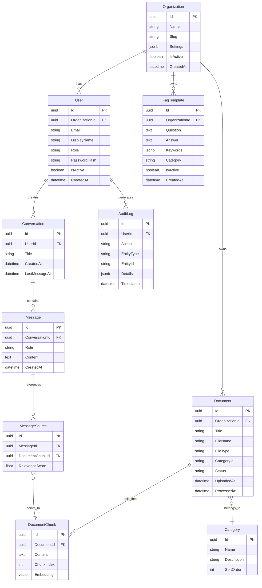

## Conceptueel Datamodel

### Entiteiten

| Entiteit | Beschrijving |
|----------|-------------|
| Organization | Zorginstelling (multi-tenant voorbereiding) |
| User | Zorgmedewerker |
| Conversation | Chat-sessie |
| Message | Individueel bericht |
| MessageSource | Bronverwijzing bij AI-antwoord |
| Document | Protocol/document |
| DocumentChunk | Tekst-fragment met embedding |
| FaqTemplate | Gestructureerd vraag-antwoord paar |
| AuditLog | Audit trail |
| Category | Documentcategorie |

### ERD

