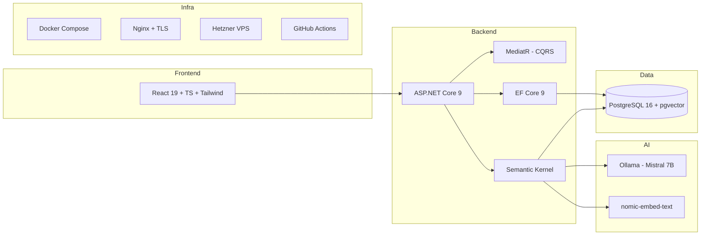

## Concrete Architectuurkeuzes

### "Als dit mijn project was, zou ik kiezen voor:"

| Aspect | Keuze | Alternatief overwogen | Reden |
|--------|-------|---------------------|-------|
| Frontend | React 19 + TS + Vite (PWA) | Blazor WASM, Vue, Angular | Figma tooling, ecosysteem, dev ervaring |
| Backend | ASP.NET Core 9 Modular Monolith | Microservices | Beheersbaar, splitbaar later |
| CQRS | MediatR + pipeline behaviors | Direct service calls | Testbaar, loose coupling |
| Database | PostgreSQL 16 + pgvector | SQL Server + Pinecone | Eén DB, gratis, .NET support |
| ORM | EF Core 9 + Npgsql | Dapper | Productiviteit, migrations |
| Vector | pgvector (in PostgreSQL) | Qdrant, Weaviate | Geen extra service |
| LLM | Ollama (Mistral 7B) + Groq fallback | Azure OpenAI | Gratis, data lokaal |
| AI Framework | Semantic Kernel | LangChain .NET | Microsoft officieel, .NET native |
| Embeddings | nomic-embed-text | multilingual-e5 | Goed meertalig, lokaal |
| Hosting | Hetzner VPS + Docker Compose | Azure Container Apps | €12/mnd, EU datacenter |
| Reverse proxy | Nginx + Let's Encrypt | Caddy, Traefik | Bewezen, lichtgewicht |
| Auth | ASP.NET Identity + JWT | Auth0, Firebase | Gratis, ingebouwd |
| Logging | Serilog + Seq | ELK, App Insights | .NET integratie, gratis |
| CI/CD | GitHub Actions | Azure DevOps | Gratis, Docker support |

### Technology Stack

### Kosten MVP

| Item | Kosten/maand |
|------|-------------|
| Hetzner VPS CX31 | €12 |
| Backup + domein | ~€3 |
| Alle software | €0 |
| **Totaal** | **~€15/maand** |
