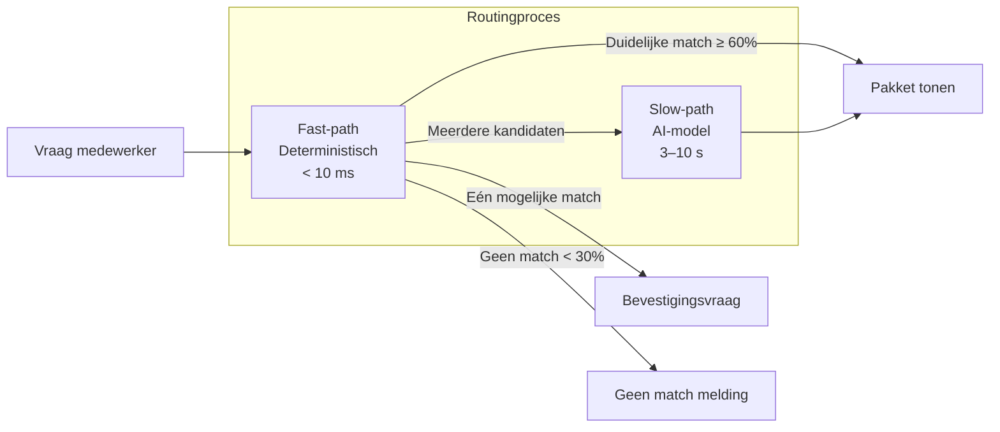

# Huidige Routing — Hoe Freddy vragen matcht aan pakketten

> **Versie:** 1.0 — maart 2026
> **Doelgroep:** Ontwikkelteam, product owners, stakeholders
> **Status:** Analyse van huidige situatie — input voor optimalisatieplan

---

## Samenvatting

Dit document beschrijft hoe Freddy op dit moment bepaalt welk kennispakket past bij een
vraag van een zorgmedewerker. Het legt uit welk AI-model wordt gebruikt, waarom dit model te
zwaar is voor de taak die het uitvoert, en welke verbetermogelijkheden er zijn.

---

## Hoe werkt routing in Freddy?

Wanneer een zorgmedewerker een vraag stelt, moet Freddy bepalen welk gepubliceerd
kennispakket het beste antwoord bevat. Dit proces heet **routing** — het is geen
antwoordgeneratie, maar een classificatietaak: "welk pakket past bij deze vraag?"

Freddy gebruikt hiervoor een **tweelaans systeem** (two-lane routing):

### Lane A — Fast-path (deterministische matching)

De fast-path vergelijkt de vraag met titels, trefwoorden en synoniemen van alle gepubliceerde
pakketten. Dit is **puur woordherkenning** — geen AI, geen taalmodel, geen kans op
onverwachte uitkomsten.

**Scoringsalgoritme:**

| Score | Wanneer |
|-------|---------|
| 1.0 | Exacte titelmatch (bijv. "Voedselbank" → pakket Voedselbank) |
| 0.7 | Titel komt voor in het bericht |
| 0.6 | Exacte trefwoord- of synoniem-match |
| 0.3 | Gedeeltelijke overlap met trefwoord (≥ 4 tekens) |
| 0.2 | Overlap met beschrijvingswoorden (≥ 2 gedeelde woorden) |

**Performance:** < 10 ms — altijd. Dit is pure stringvergelijking.

**Verantwoordelijk bestand:** `FastPathRouter.cs` in de Infrastructure-laag.

### Lane B — Slow-path (AI-model / LLM)

De slow-path wordt **alleen** geactiveerd wanneer de fast-path twee of meer kandidaten vindt
met vergelijkbare scores (het "dubbelzinnigheidsgebied" tussen 30% en 60%). In dat geval
stuurt Freddy de vraag samen met de kandidaat-pakketten naar een taalmodel dat het beste
pakket kiest.

**Verantwoordelijk bestand:** `OllamaPackageRouter.cs` in de Infrastructure-laag.

---

## Welk AI-model draait nu?

| Eigenschap | Waarde |
|------------|--------|
| **Model** | `mistral:7b` (Mistral 7B) |
| **Parameters** | 7 miljard |
| **Geheugengebruik** | ~4,5 GB RAM (Q4 kwantisatie) |
| **Generatiesnelheid (CPU)** | ~5–10 tokens per seconde |
| **Provider** | Ollama (lokaal, self-hosted) |
| **Configuratie** | `appsettings.json` → `AI:ModelId` |

### Wat doet het model precies?

Het model ontvangt:

1. Een **systeemprompt** die zegt: "Je bent een classificatie-engine. Kies het beste pakket
   en geef antwoord als JSON."
2. De **gebruikersvraag** en een **lijst van kandidaat-pakketten** (ID, naam, beschrijving).

Het model retourneert een JSON-object met:

- `chosenPackageId` — het gekozen pakket
- `confidence` — een zekerheidspercentage (0.0 – 1.0)
- `needsConfirmation` — of bevestiging nodig is
- `reason` — korte toelichting

**Belangrijk:** het model genereert **geen** antwoord voor de gebruiker. Het kiest alleen welk
pakket getoond moet worden. Alle antwoordtekst komt uit het pakket zelf.

---

## Waarom is Mistral 7B te zwaar voor deze taak?

### Het probleem in het kort

Mistral 7B is een **algemeen taalmodel** met 7 miljard parameters, ontworpen voor complexe
taken zoals creatief schrijven, codegeneratie en uitgebreide redenatie. Freddy gebruikt het
uitsluitend als **classificator**: kies 1 pakket uit een lijst van 2–5 kandidaten.

Dit is vergelijkbaar met het gebruiken van een vrachtauto om een envelop te bezorgen — het
werkt, maar is niet efficiënt.

### Concrete impact

| Aspect | Huidige situatie | Probleem |
|--------|-----------------|----------|
| **Latency** | 3–10 seconden per slow-path verzoek (CPU-only VPS) | Zorgmedewerker wacht onnodig lang bij dubbelzinnige vragen |
| **Geheugen** | ~4,5 GB RAM permanent geclaimd | Beperkt ruimte voor database en overige services op VPS |
| **Timeout** | 5 minuten (hardcoded in HttpClient) | Veel te ruim — bij trage respons wacht het systeem eindeloos |
| **Generatie-instellingen** | Niet geconfigureerd (geen temperature, geen max tokens) | Model kan onnodig lange of creatieve output produceren |
| **Evenredigheid** | 7B parameters voor een taak die ~60 tokens JSON output vereist | Overkill — kleinere modellen kunnen dit minstens zo goed |

### Gemiddelde latency-schatting

Op een standaard VPS (4 vCPU, 8 GB RAM, geen GPU):

| Fase | Latency |
|------|---------|
| Fast-path (altijd) | < 10 ms |
| Slow-path (Mistral 7B, ~80 tokens output) | **3–10 seconden** |
| Totaal bij dubbelzinnige vraag | **3–10 seconden** |

De meeste vragen gaan via de fast-path (< 10 ms), maar bij dubbelzinnigheid — precies het
moment dat de gebruiker al onzeker is — duurt het antwoord het langst. Dit is de slechtste
plek voor hoge latency.

---

## Wat ontbreekt er architectonisch?

### 1. Geen inference-parameters

De `OllamaPackageRouter` roept het model aan zonder `PromptExecutionSettings`. Dit betekent:

- **Temperature:** niet ingesteld (standaard ~0.7) — te creatief voor classificatie
- **Max tokens (`num_predict`):** niet ingesteld — model kan onbeperkt genereren
- **Context window (`num_ctx`):** niet ingesteld — Ollama gebruikt standaard 2048 of meer

De `instructions.md` specificeert `Temperature: 0.1` en `Max tokens: 512`, maar deze waarden
worden nergens in de code doorgegeven.

### 2. Timeout is onrealistisch

De `HttpClient.Timeout` staat op **5 minuten**. Voor een classificatietaak die maximaal 1–2
seconden zou moeten duren (met het juiste model), is dit onacceptabel. Als Ollama vastloopt,
wacht Freddy 5 minuten voordat er een foutmelding komt.

### 3. Geen small talk afhandeling

Berichten zoals "Hoi", "Dank je wel", of "Ik snap het niet" vallen door het hele
routingsysteem:

1. Fast-path scoort < 0.3 (geen pakketmatch)
2. Resultaat: "Geen passend pakket gevonden"

Dit voelt koud en onpersoonlijk. De gebruiker verwacht een menselijke reactie op een
begroeting, niet een foutmelding.

### 4. Dubbele confidence-drempel

Er zijn twee onafhankelijke confidence-drempels:

- `CompositePackageRouter`: ≥ 0.6 = hoge zekerheid, ≥ 0.3 = dubbelzinnig
- `SendMessageCommandHandler`: < 0.8 = altijd bevestiging vragen

Dit creëert een situatie waarin de router een resultaat met 0.7 confidence als "hoge
zekerheid" beschouwt, maar de handler toch om bevestiging vraagt. Het is niet fout, maar het
is verwarrend voor het team en kan onverwacht gedrag opleveren.

---

## Conclusie

De huidige routing-architectuur is **functioneel correct** — de fast-path werkt uitstekend
voor directe matches en het tweelaans systeem voorkomt onnodige AI-kosten. Maar de slow-path
is **onnodig zwaar** door het gebruik van Mistral 7B zonder geoptimaliseerde
inference-parameters, en de afwezigheid van small talk afhandeling maakt de
gebruikerservaring onnodig koud.

De volgende stap is het vervangen van het routing-model door een lichtgewicht alternatief
(1B–3B parameters) en het toevoegen van een small talk detectielaag vóór de routingpipeline.
Zie:

- [ADR-0005: Lightweight LLM voor Routing](adr/0005-lightweight-llm.md)
- [Chitchat Design](../mvp/chitchat-design.md)
