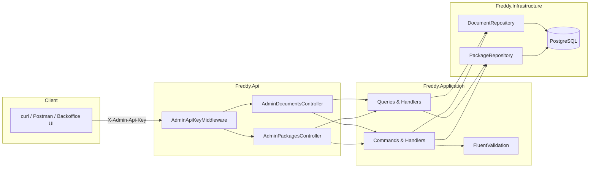
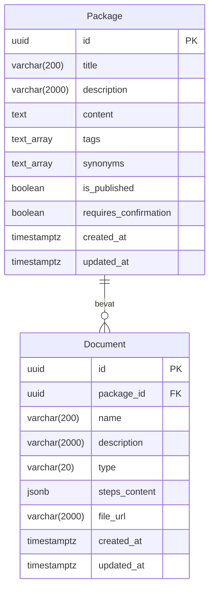

# Backoffice API — Pakketjes & Documenten

MVP Admin API voor het beheren van pakketjes en documenten.

## Architectuur



## Authenticatie

Alle `/api/admin/` routes zijn beveiligd met een API key via de `X-Admin-Api-Key` header.

| Header              | Waarde                      |
|---------------------|-----------------------------|
| `X-Admin-Api-Key`   | `freddy-admin-dev-key` (dev)|

Bij een ontbrekende of foutieve key retourneert de API `401 Unauthorized` met een Problem Details response.

## Endpoints

### Packages

| Methode  | Route                                | Omschrijving             |
|----------|--------------------------------------|--------------------------|
| `GET`    | `/api/admin/packages`                | Lijst van alle pakketjes |
| `GET`    | `/api/admin/packages/{id}`           | Haal pakketje op         |
| `POST`   | `/api/admin/packages`                | Maak pakketje aan        |
| `PUT`    | `/api/admin/packages/{id}`           | Bewerk pakketje          |
| `DELETE` | `/api/admin/packages/{id}`           | Verwijder pakketje       |
| `POST`   | `/api/admin/packages/{id}/publish`   | Publiceer pakketje       |
| `POST`   | `/api/admin/packages/{id}/unpublish` | Depubliceer pakketje     |

#### Query parameters (GET lijst)

| Parameter     | Type     | Omschrijving                          |
|---------------|----------|---------------------------------------|
| `isPublished` | `bool?`  | Filter op publicatiestatus            |
| `search`      | `string?`| Zoek in titel en omschrijving (ILike) |

### Documents

| Methode  | Route                                                    | Omschrijving             |
|----------|----------------------------------------------------------|--------------------------|
| `GET`    | `/api/admin/packages/{packageId}/documents`              | Lijst documenten         |
| `POST`   | `/api/admin/packages/{packageId}/documents`              | Maak document aan        |
| `PUT`    | `/api/admin/packages/{packageId}/documents/{id}`         | Bewerk document          |
| `DELETE` | `/api/admin/packages/{packageId}/documents/{id}`         | Verwijder document       |

#### Document types

| Type    | Omschrijving                                  | Verplichte velden  |
|---------|-----------------------------------------------|--------------------|
| `Pdf`   | PDF bestand via URL                           | `fileUrl`          |
| `Steps` | Stap-voor-stap instructies (JSON)             | `stepsContent`     |
| `Link`  | Externe link/URL                              | `fileUrl`          |

## Datamodel



## Chat integratie

Alleen pakketjes met `is_published = true` zijn zichtbaar voor de chat-engine. De `SendMessageCommandHandler` gebruikt `GetAllPublishedAsync()` om kandidaten op te halen voor de package router.

## Lokaal testen

### Vereisten

- Docker containers draaien: `docker compose -f infra/docker-compose.yml up -d`
- API starten: `dotnet run --project src/Freddy.Api`
- Migraties toepassen: `dotnet ef database update --project src/Freddy.Infrastructure --startup-project src/Freddy.Api`

### Voorbeelden met curl

```bash
# Lijst alle pakketjes
curl -s http://localhost:5000/api/admin/packages \
  -H "X-Admin-Api-Key: freddy-admin-dev-key" | jq

# Maak een pakketje aan
curl -s -X POST http://localhost:5000/api/admin/packages \
  -H "X-Admin-Api-Key: freddy-admin-dev-key" \
  -H "Content-Type: application/json" \
  -d '{
    "title": "Medicatie Protocol",
    "description": "Protocol voor het uitdelen van medicatie",
    "content": "Stap 1: Controleer de medicatielijst.\nStap 2: Verifieer met de cliënt.",
    "tags": ["medicatie", "protocol"],
    "synonyms": ["medicijnen", "pillen"]
  }' | jq

# Publiceer het pakketje (vervang {id} met echt ID)
curl -s -X POST http://localhost:5000/api/admin/packages/{id}/publish \
  -H "X-Admin-Api-Key: freddy-admin-dev-key" | jq

# Voeg een document toe
curl -s -X POST http://localhost:5000/api/admin/packages/{id}/documents \
  -H "X-Admin-Api-Key: freddy-admin-dev-key" \
  -H "Content-Type: application/json" \
  -d '{
    "name": "Medicatie Stappenplan",
    "description": "Stap-voor-stap handleiding",
    "type": "Steps",
    "stepsContent": "[{\"step\":1,\"text\":\"Check medicatielijst\"},{\"step\":2,\"text\":\"Verifieer met cliënt\"}]"
  }' | jq

# Zonder API key → 401
curl -s http://localhost:5000/api/admin/packages | jq
```

### PowerShell voorbeelden

```powershell
$headers = @{ "X-Admin-Api-Key" = "freddy-admin-dev-key" }

# Lijst pakketjes
Invoke-RestMethod -Uri "http://localhost:5000/api/admin/packages" -Headers $headers

# Maak pakketje
$body = @{
    title = "Medicatie Protocol"
    description = "Protocol voor het uitdelen van medicatie"
    content = "Stap 1: Controleer de medicatielijst."
    tags = @("medicatie", "protocol")
    synonyms = @("medicijnen")
} | ConvertTo-Json

Invoke-RestMethod -Method POST -Uri "http://localhost:5000/api/admin/packages" `
    -Headers $headers -ContentType "application/json" -Body $body
```
