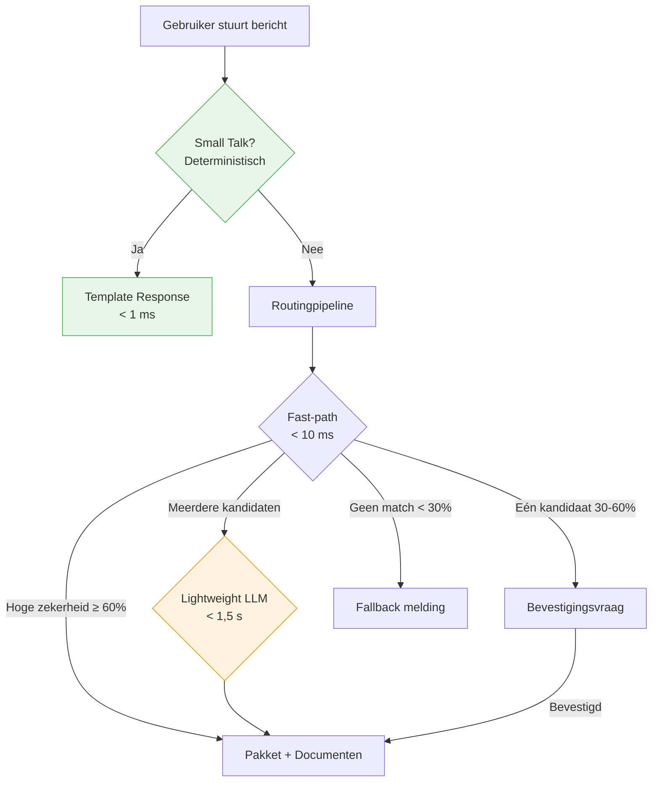
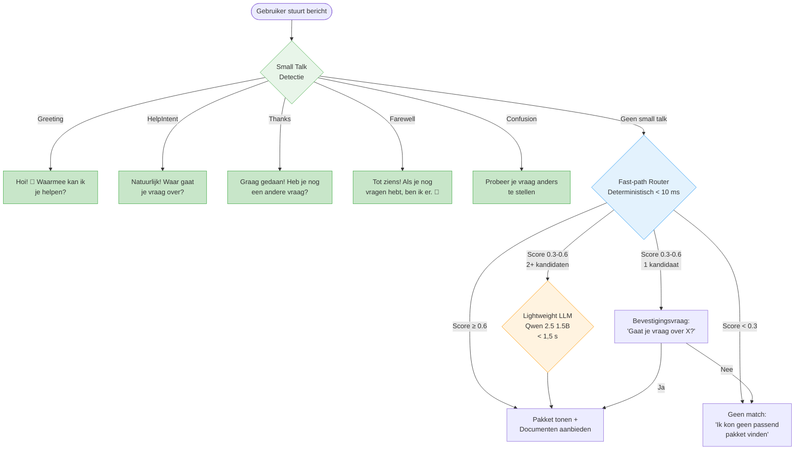

# Chitchat Design — Small Talk Afhandeling in Freddy MVP

> **Versie:** 1.0 — maart 2026
> **Doelgroep:** Ontwikkelteam, product owners, stakeholders
> **Status:** Proposed — onderdeel van lightweight LLM optimalisatie

---

## Samenvatting

Dit document beschrijft het ontwerp voor small talk afhandeling in Freddy. Het doel is om
alledaagse berichten zoals begroetingen, bedankjes en verwarring netjes af te handelen met
vaste template-antwoorden — zonder vrije tekstgeneratie, zonder AI, en zonder het
pakket-principe te doorbreken.

---

## Waarom is dit nodig?

### Het huidige probleem

Wanneer een zorgmedewerker "Hoi" of "Dank je wel" typt, doorloopt dit bericht het volledige
routingsysteem:

1. Fast-path: scoort < 0.3 (geen pakketmatch)
2. Resultaat: **"Geen passend pakket gevonden"**

Dit is technisch correct maar voelt koud en onpersoonlijk. Een chatassistent die niet kan
reageren op een begroeting voelt gebrekkig — ongeacht hoe goed de inhoudelijke antwoorden
zijn.

### Wat we willen bereiken

- Begroetingen beantwoorden met een vriendelijke, uitnodigende reactie
- Bedankjes opvangen zodat het gesprek natuurlijk aanvoelt
- Verwarde gebruikers een handvat geven om hun vraag te herformuleren
- Dit alles **zonder** het pakket-first principe te doorbreken

### Impact op metrics

- Berichten die nu onnodig door de routingpipeline gaan worden eerder afgevangen
- Het percentage berichten dat de LLM slow-path bereikt daalt
- De gebruikerservaring verbetert meetbaar (minder koude fallback-berichten)

---

## Architectuur

### Plaats in de pipeline

Small talk detectie vindt plaats **vóór** de routingpipeline, als eerste stap in
`SendMessageCommandHandler`:



**Waarom vóór routing?**

- Voorkomt onnodige fast-path berekeningen op berichten die geen vraag bevatten
- Maakt de routing-logs schoner (geen noise van begroetingen)
- Latency: < 1 ms voor detectie + template, versus 10+ ms als het door de fast-path gaat

### Component-overzicht

```
Application/Common/Interfaces/
  ISmallTalkDetector.cs          ← Interface

Infrastructure/AI/
  SmallTalkDetector.cs           ← Deterministische implementatie
  SmallTalkCategory.cs           ← Enum (Greeting, HelpIntent, Thanks, etc.)

Application/Features/Chat/Commands/
  SendMessageCommandHandler.cs   ← Roept ISmallTalkDetector aan vóór IPackageRouter
```

---

## Stap 1 — Small Talk Detectie

### Detectiecategorieën

| Categorie | Voorbeelden | Detectiemethode |
|-----------|-------------|-----------------|
| `Greeting` | "Hoi", "Goedemorgen", "Hey", "Hallo Freddy" | Woordenlijst |
| `HelpIntent` | "Ik heb een vraag", "Kun je me helpen?", "Help" | Phrase-lijst |
| `Thanks` | "Dank je", "Bedankt", "Top, thanks", "Dankjewel" | Woordenlijst |
| `Farewell` | "Doei", "Tot ziens", "Fijne dag" | Woordenlijst |
| `GenericConfusion` | "Huh?", "Wat?", "Ik snap het niet", "???" | Phrase-lijst |
| `None` | Alles wat niet matcht | Valt door naar routing |

### Implementatieaanpak: puur deterministisch

De detectie werkt via **genormaliseerde woordherkenning** tegen gecureerde Nederlandse
lijsten. Geen regex, geen LLM, geen fuzzy matching — pure exacte stringvergelijking na
normalisatie (lowercase, trim, diakritische tekens behouden).

**Algoritme:**

```
1. Normaliseer invoer (lowercase, trim)
2. Controleer of het volledige bericht een bekende phrase is (exacte match)
3. Controleer of het bericht begint met een bekend woord + optioneel extra tekst
4. Controleer op specifieke patronen (alleen leestekens, etc.)
5. Indien geen match → return SmallTalkCategory.None
```

**Waarom deterministisch en niet LLM-based?**

| Criterium | Deterministisch | LLM-based |
|-----------|----------------|-----------|
| Latency | < 1 ms | 500 ms – 2 s |
| Voorspelbaarheid | 100% — altijd hetzelfde resultaat | Kan variëren per aanroep |
| Testbaarheid | Volledig unit-testbaar | Vereist golden set + tolerantie |
| Afhankelijkheid | Geen — draait zonder Ollama | Vereist draaiend LLM |
| Onderhoudbaarheid | Woordenlijst bijwerken | Prompt tuning |
| Voldoende voor MVP? | **Ja** — vaste set categorieën | Overkill voor 5 categorieën |

**Conclusie:** voor de MVP zijn 5 categorieën met bekende Nederlandse uitdrukkingen ruim
voldoende af te vangen met woordenlijsten. Een LLM-based detectie kan in een latere fase
toegevoegd worden als de categorieën complexer worden.

### Woordenlijsten (indicatief)

**Greeting:**

```
hoi, hallo, hey, hi, goedemorgen, goedemiddag, goedeavond, goedenacht,
dag, yo, hee, heey, moin, hallootjes, hoi hoi, goeiemorgen, goeiendag
```

**HelpIntent:**

```
ik heb een vraag, kun je me helpen, help, hulp, ik zoek iets,
ik wil iets weten, waar kan ik terecht, hoe werkt dit, wat kan je
```

**Thanks:**

```
dank je, bedankt, dankjewel, thanks, dank je wel, dank u, dank u wel,
hartelijk dank, top bedankt, super bedankt, fijn dank je, merci
```

**Farewell:**

```
doei, dag, tot ziens, fijne dag, tot de volgende keer, bye, doeg,
tot later, fijne avond, fijne dienst, succes
```

**GenericConfusion:**

```
huh, wat, hè, ik snap het niet, ik begrijp het niet, wat bedoel je,
ik snap er niks van, ???, ??, help ik snap het niet
```

> **Opmerking:** de definitieve woordenlijsten worden samengesteld tijdens implementatie en
> gevalideerd met unit tests. De lijsten hierboven zijn een startpunt.

---

## Stap 2 — Template Responses

Elke detectiecategorie heeft een vast, hardcoded template-antwoord:

| Categorie | Template response |
|-----------|------------------|
| `Greeting` | "Hoi! 👋 Waarmee kan ik je helpen?" |
| `HelpIntent` | "Natuurlijk! Waar gaat je vraag over?" |
| `Thanks` | "Graag gedaan! Heb je nog een andere vraag?" |
| `Farewell` | "Tot ziens! Als je nog vragen hebt, ben ik er. 👋" |
| `GenericConfusion` | "Geen probleem! Probeer je vraag anders te stellen, bijvoorbeeld: *'Hoe vraag ik een voedselpakket aan?'*" |

### Ontwerpprincipes

1. **Geen vrije generatie** — elk antwoord is een hardcoded string
2. **Geen zorginhoud** — templates verwijzen nooit naar specifieke protocollen of procedures
3. **Uitnodigend** — elk template moedigt de gebruiker aan om een inhoudelijke vraag te stellen
4. **Nederlands B1-niveau** — eenvoudige, duidelijke taal
5. **Kort** — maximaal 1–2 zinnen

### Waarom dit veilig is binnen pakket-first architectuur

De pakket-first architectuur garandeert dat **elk inhoudelijk antwoord herleidbaar is naar een
door beheerders gepubliceerd pakket**. Small talk templates doorbreken dit principe niet,
omdat ze:

- **Geen inhoudelijke informatie bevatten** — ze zeggen niet "Je moet X doen" of "Het protocol
  is Y"
- **Geen AI-generatie gebruiken** — geen kans op hallucinatie
- **Altijd terugverwijzen naar het stellen van een vraag** — de gebruiker wordt teruggeleidi
  naar de routingpipeline
- **Niet variëren** — altijd exact dezelfde response, 100% voorspelbaar en auditeerbaar

**Vergelijking met een antwoordapparaat:** wanneer je belt met een klantenservice, zegt het
systeem "Goedemiddag, waarmee kan ik u helpen?" — dit is geen inhoudelijk advies, maar een
standaard begroeting die de interactie opent. Freddy's small talk templates werken identiek.

---

## Nieuwe Conversatie Flow (Compleet)

### Mermaid diagram



### Uitleg voor stakeholders

De conversatie-flow van Freddy werkt in drie lagen, van snel naar langzaam:

**Laag 1 — Small Talk (< 1 ms)**
Alledaagse berichten zoals begroetingen, bedankjes en verwarring worden direct herkend en
beantwoord met een vaste, vriendelijke tekst. Dit maakt Freddy menselijk en toegankelijk. Er
wordt geen AI gebruikt — het is pure woordherkenning.

**Laag 2 — Fast-path Routing (< 10 ms)**
Inhoudelijke vragen worden vergeleken met de titels, trefwoorden en synoniemen van alle
gepubliceerde pakketten. Bij een duidelijke match (≥ 60% zekerheid) wordt het pakket direct
getoond. Bij enige twijfel (30–60%) vraagt Freddy om bevestiging. De overgrote meerderheid
van alle vragen wordt via deze laag beantwoord.

**Laag 3 — Lightweight LLM (< 1,5 seconde)**
Alleen wanneer de fast-path twee of meer kandidaten vindt met vergelijkbare scores, wordt een
klein, snel taalmodel ingeschakeld om het beste pakket te kiezen. Dit model genereert geen
antwoord — het kiest alleen. Door een lichtgewicht model te gebruiken (1,5 miljard parameters
in plaats van 7 miljard), is dit proces nu aanzienlijk sneller.

**Het resultaat:** de meeste interacties zijn binnen 10 milliseconden afgehandeld. Zelfs in
het slechtste geval (LLM slow-path) duurt het minder dan 2 seconden. Freddy voelt daardoor
snel, betrouwbaar en professioneel.

---

## Metrics & Validatie

### Latency Targets

| Route | Huidig | Nieuw Target | Verbetering |
|-------|--------|-------------|-------------|
| Small talk → template | N/A (niet afgehandeld) | **< 1 ms** | Nieuw |
| Fast-path → pakket | < 10 ms | **< 10 ms** | Ongewijzigd |
| Slow-path → LLM classificatie | 3–10 s (Mistral 7B) | **< 1,5 s** (Qwen 2.5 1.5B) | **5–8×** sneller |
| End-to-end (p95) | 1–10 s | **< 2 s** | Significant |
| Fallback (geen match) | < 1 s | **< 1 s** | Ongewijzigd |

### Request Distributie Targets

| Route | Huidig (geschat) | Target |
|-------|-----------------|--------|
| Small talk (template) | 0% (niet afgevangen) | **10–15%** van alle berichten |
| Fast-path (deterministic) | ~80% | **~75%** (iets lager door small talk afsplitsing) |
| Slow-path (LLM) | ~20% | **< 10%** |
| Geen match (fallback) | ~5–10% | **< 5%** (minder door small talk afvang) |

### Small Talk Kwaliteit

| Metric | Target | Hoe meten |
|--------|--------|-----------|
| Correct gedetecteerd (recall) | > 95% van veelvoorkomende uitdrukkingen | Unit tests met gecureerde testset |
| False positives (precisie) | < 2% | Unit tests: echte vragen die onterecht als small talk worden geclassificeerd |
| Categorieën gedekt | Greeting, HelpIntent, Thanks, Farewell, GenericConfusion | Code review + lijstvalidatie |

### Hoe meten we dit?

1. **Structured logging** — Elk bericht logt de gekozen route als tag:
   - `routing.lane: small-talk | fast-path | slow-path`
   - `routing.latency_ms: <waarde>`
   - `routing.model: none | qwen2.5:1.5b`
   - `routing.category: greeting | help-intent | thanks | ...` (alleen bij small talk)

2. **Seq dashboard** — Real-time overzicht van:
   - Verdeling per route (pie chart)
   - P50/P95/P99 latency per route
   - Trend over tijd

3. **Stopwatch-based timing** — `Stopwatch` rondom de routing-calls in
   `CompositePackageRouter` en `OllamaPackageRouter` (al aanwezig in logregels, formaliseren
   naar structureel veld)

4. **Unit test coverage** — SmallTalkDetector testset met minimaal 50 voorbeelden
   (10 per categorie) + minimaal 20 negatieve cases (echte vragen die niet als small talk
   geclassificeerd mogen worden)

---

## Concrete Implementatie Takenlijst

> **Let op:** dit is een planningsdocument. Er wordt nog geen code geschreven.

### Model vervangen

- [ ] `ollama pull qwen2.5:1.5b` op alle development machines
- [ ] `appsettings.json`: `AI:ModelId` wijzigen naar `qwen2.5:1.5b`
- [ ] `appsettings.Development.json`: bevestig ModelId override indien aanwezig
- [ ] Valideer dat Ollama het model correct laadt en JSON produceert

### Router parameters aanpassen

- [ ] `OllamaPackageRouter.RouteAsync`: voeg `PromptExecutionSettings` toe
  - `Temperature = 0.1`
  - `MaxTokens = 128` (maps naar `num_predict` in Ollama)
- [ ] `DependencyInjection.cs`: wijzig `HttpClient.Timeout` van 5 minuten naar `15 seconden`
- [ ] Overweeg `AI:TimeoutSeconds` configuratiesleutel voor flexibiliteit
- [ ] Optioneel: `num_ctx: 2048` via Ollama modelfile of environment variable

### SmallTalkService toevoegen

- [ ] `ISmallTalkDetector` interface in `Application/Common/Interfaces/`
  - `SmallTalkResult Detect(string message)`
- [ ] `SmallTalkCategory` enum in `Application/Common/Interfaces/`
  - `None, Greeting, HelpIntent, Thanks, Farewell, GenericConfusion`
- [ ] `SmallTalkResult` record in `Application/Common/Interfaces/`
  - `SmallTalkCategory Category, string? TemplateResponse`
- [ ] `SmallTalkDetector` implementatie in `Infrastructure/AI/`
  - Genormaliseerde woordenlijsten per categorie
  - Template responses per categorie
  - Detectiealgoritme: exacte phrase match → prefix match → pattern match
- [ ] Registreer `ISmallTalkDetector → SmallTalkDetector` in `DependencyInjection.cs`

### Chat pipeline aanpassen

- [ ] `SendMessageCommandHandler`: roep `ISmallTalkDetector.Detect()` aan vóór
  `RouteAndBuildResponseAsync()`
- [ ] Bij `SmallTalkCategory != None`: sla routing over, gebruik template response direct
- [ ] Sla small talk bericht + response op in conversatie-historie (geen `PendingState`)

### Logging uitbreiden

- [ ] Voeg `routing.lane` tag toe aan alle routing-logberichten
- [ ] Voeg `routing.latency_ms` toe (Stopwatch rondom routing-calls)
- [ ] Voeg `routing.model` toe (none voor fast-path/small-talk, modelnaam voor slow-path)
- [ ] Voeg `routing.category` toe voor small talk berichten

### Tests toevoegen

- [ ] `SmallTalkDetectorTests.cs` — minimaal 50 positive cases + 20 negative cases
  - Elke categorie: exacte match, variaties, hoofdletters, extra spaties
  - Negatieve cases: echte vragen die NIET als small talk geclassificeerd mogen worden
    (bijv. "Hoi, hoe vraag ik een voedselpakket aan?" → moet naar routing, niet small talk)
- [ ] Update bestaande `CompositePackageRouterTests` — verifieer dat fast-path/slow-path
  ongewijzigd werkt
- [ ] Update `SendMessageCommandHandlerTests` — voeg tests toe voor small talk flow
- [ ] Benchmark test: verifieer slow-path latency < 1,5 seconde met Qwen 2.5 1.5B

### Documentatie updaten

- [ ] Dit document: finaliseer woordenlijsten na implementatie
- [ ] `docs/solution/freddy-mvp-solution-overview.md`: update LLM-sectie en voeg small talk
  toe
- [ ] `docs/architecture/adr/README.md`: voeg ADR-0005 toe aan index
- [ ] Memory bank: update `activeContext.md`, `progress.md`, `systemPatterns.md`,
  `techContext.md`

---

## Constraints & Afbakening

| Wel | Niet |
|-----|------|
| Deterministische small talk detectie | LLM-based intent classificatie |
| Vaste template responses | Vrije tekstgeneratie voor small talk |
| 5 categorieën (Greeting, Help, Thanks, Farewell, Confusion) | Open-ended conversatie |
| Nederlandse woordenlijsten | Meertalige ondersteuning |
| Modelwissel naar Qwen 2.5 1.5B | RAG implementatie |
| Inference-parameters toevoegen | Embeddings of vector search |
| Logging verbetering | Analytics dashboard bouwen |

---

## Gerelateerde documenten

- [ADR-0005: Lightweight LLM voor Routing](../architecture/adr/0005-lightweight-llm.md)
- [Huidige Routing Analyse](../architecture/current-routing-explained.md)
- [Freddy MVP Solution Overview](../solution/freddy-mvp-solution-overview.md)
