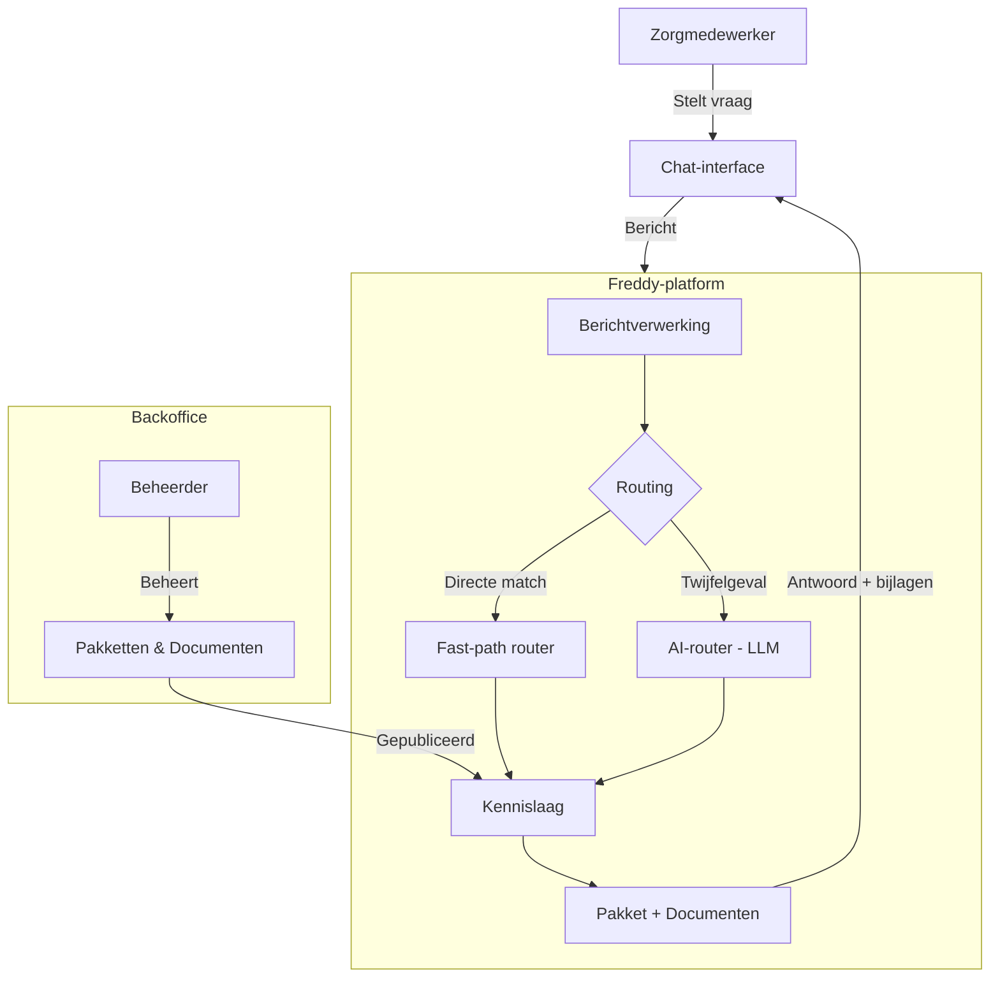
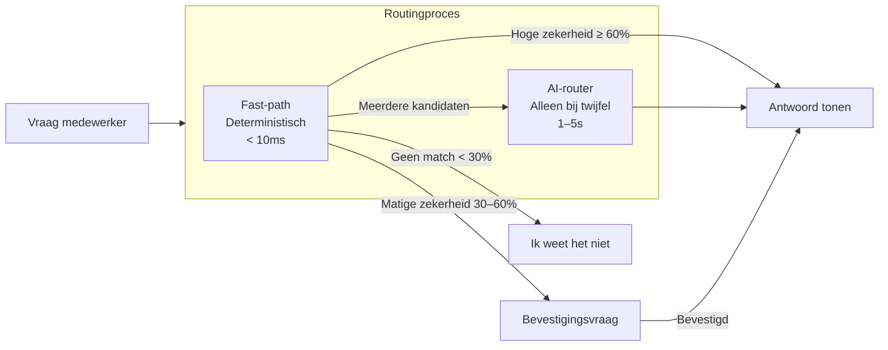

# Freddy – MVP Solution Overview

> **Versie:** 1.0 — maart 2026
> **Doelgroep:** Stakeholders, management, product owners
> **Status:** MVP — in actieve ontwikkeling

---

## 1. Wat is Freddy?

Freddy is een AI-ondersteunde chatassistent voor zorginstellingen. Het stelt zorgmedewerkers in staat om in gewone spreektaal vragen te stellen over protocollen, procedures en formulieren — en binnen enkele seconden een helder, betrouwbaar antwoord te krijgen.

**Doelgroep:**
- Verpleegkundigen en verzorgenden die snel het juiste protocol willen vinden
- Teamleiders die medewerkers willen ondersteunen bij het opvolgen van richtlijnen
- Kwaliteits- en beleidsmedewerkers die kennisbeheer centraal willen inrichten

**Het probleem dat we oplossen:**

Zorgmedewerkers besteden gemiddeld 15 tot 30 minuten per dienst aan het opzoeken van informatie. Protocollen staan verspreid over intranet, gedeelde mappen en e-mail. Nieuwe medewerkers weten de weg niet, en er bestaat een reëel risico dat er gehandeld wordt op basis van verouderde of onjuiste informatie.

**Waarom dit relevant is in de zorg:**

In een zorgomgeving is consistentie geen luxe, maar een vereiste. Verkeerde of tegenstrijdige informatie kan directe gevolgen hebben voor de kwaliteit en veiligheid van zorg. Freddy brengt de juiste kennis altijd en direct beschikbaar — zonder zoekwerk, zonder twijfel.

---

## 2. Hoe werkt Freddy in de praktijk?

Een zorgmedewerker opent Freddy op telefoon, tablet of laptop. Er is geen training of handleiding nodig. Het werkt als een gewoon gesprek.

**Stap voor stap:**

1. **De medewerker stelt een vraag in eigen woorden**
   Bijvoorbeeld: *"Hoe vraag ik een voedselpakket aan voor een cliënt?"*

2. **Freddy herkent de vraag**
   Achter de schermen wordt bepaald welk protocol of kennisblok het beste aansluit bij de vraag. Dit gebeurt razendsnel — in de meeste gevallen zonder AI.

3. **Freddy vraagt ter bevestiging (indien nodig)**
   Als er enige onzekerheid is, vraagt Freddy kort om bevestiging: *"Ik denk dat je vraag gaat over [onderwerp]. Klopt dat?"* Dit voorkomt het tonen van een verkeerd antwoord.

4. **Freddy toont het antwoord**
   Het antwoord bestaat uit een heldere uitleg, eventuele stappen die gevolgd moeten worden, en relevante documenten of formulieren die direct gedownload of geopend kunnen worden.

5. **De medewerker heeft wat nodig is**
   Het gehele proces duurt doorgaans minder dan tien seconden. De conversatiegeschiedenis blijft beschikbaar zodat eerder gestelde vragen teruggevonden kunnen worden.

---

## 3. De Architectuur in één oogopslag

**Uitleg van het diagram:**

- De **zorgmedewerker** communiceert uitsluitend via de chatinterface.
- Elke vraag wordt verwerkt door het **Freddy-platform**, dat bepaalt welk kennisblok relevant is.
- De **routing** verloopt in twee stappen: een snelle deterministische match, en alleen bij twijfel een AI-model. Dit maakt Freddy snel én betrouwbaar.
- Alle antwoorden zijn gebaseerd op **pakketten en documenten** die beheerders zelf hebben ingevoerd en gepubliceerd via de backoffice.
- De backoffice is volledig gescheiden van de chatinterface, maar voedt de kennislaag waarop Freddy draait.

---

## 4. De Rol van de Backoffice

De backoffice is de kern van Freddy. Zonder goed beheerde kennis is er geen goed antwoord.

**Wat is een Pakket?**

Een pakket is een afgebakend kennisblok over één specifiek protocol, procedure of onderwerp. Denk aan: *aanvraag voedselpakket*, *medicatieprotocol*, of *incidentmelding*. Elk pakket bevat een beschrijving, stappen, trefwoorden en eventuele documenten.

**Wat is een Document?**

Een document is bijlagemateriaal dat bij een pakket hoort. Dit kan een PDF zijn, een formulier, een stappenplan of een externe link. Wanneer Freddy een pakket toont, worden de bijbehorende documenten direct aangeboden als downloadbare bestanden of klikbare links.

**Hoe voegen beheerders kennis toe?**

Via de backoffice kunnen beheerders — zonder technische kennis — nieuwe pakketten aanmaken, bestaande aanpassen, documenten uploaden en pakketten publiceren of verbergen. Een pakket is pas zichtbaar in de chatinterface nadat het expliciet gepubliceerd is. Dit voorkomt dat onvoltooide of onjuiste informatie bij medewerkers terechtkomt.

**Waarom dit de kern is van Freddy:**

Freddy verzint geen informatie. Het systeem verwijst altijd naar wat door een beheerder is ingevoerd en goedgekeurd. Dit is een bewuste keuze: zorgadvies moet controleerbaar, verifieerbaar en menselijk gevalideerd zijn.

**Freddy hallucineert niet** — er is geen sprake van een AI die op basis van training een antwoord bedenkt. Elk antwoord is terug te herleiden naar een specifiek pakket dat door een organisatie zelf is opgesteld.

---

## 5. Hoe werkt de slimme routing?

Routing is het proces waarbij Freddy bepaalt welk pakket het beste aansluit bij de vraag van de medewerker. Dit wordt gedaan via een tweelaans systeem.

**Fast-path — de snelle route:**

De fast-path vergelijkt de vraag van de medewerker met titels, trefwoorden en synoniemen van alle gepubliceerde pakketten. Dit is volledig deterministisch — geen AI, geen kans op onverwachte uitkomsten. Resultaat in minder dan tien milliseconden. De overgrote meerderheid van alle vragen wordt via deze route beantwoord.

**Slow-path — alleen bij echte twijfel:**

Wanneer meerdere pakketten een vergelijkbare score hebben en de fast-path geen duidelijke winnaar kan aanwijzen, wordt een taalmodel (LLM) ingezet. Dit model leest de beschikbare kandidaten en kiest het meest passende pakket. Het model genereert geen antwoord — het kiest alleen.

**Waarom dit beter werkt dan alles door de AI laten lopen:**
- De fast-path is **deterministische logica** — altijd hetzelfde resultaat bij dezelfde invoer
- De slow-path (AI) wordt alleen gebruikt wanneer het echt nodig is
- Dit maakt het systeem **voorspelbaar, auditeerbaar en controleerbaar**
- Geschikt voor een zorgomgeving waar transparantie vereist is

---

## 6. Waarom gebruiken we een LLM (zoals Ollama)?

Een **Large Language Model (LLM)** is een geavanceerd taalmodel dat in staat is om tekst te begrijpen en te interpreteren. Freddy maakt hier beperkt gebruik van — en dat is een bewuste keuze.

**Wat het taalmodel doet:**
- Het leest kandidaat-pakketten en bepaalt welk pakket het beste past bij de vraag
- Het helpt bij het interpreteren van nuances in taal die een eenvoudige woordmatch mist

**Wat het taalmodel NIET doet:**
- Het genereert geen zorgadvies of medische antwoorden
- Het produceert geen tekst die als antwoord naar de medewerker gaat
- Het raadpleegt geen externe bronnen
- Het "bedenkt" niets — het kiest altijd uit een vastgestelde lijst van gepubliceerde pakketten

**Waarom dit aanpak hallucinaties voorkomt:**

Een taalmodel dat vrij antwoorden genereert, kan plausibel klinkende maar feitelijk onjuiste informatie produceren — dit heet een *hallucinatie*. Door het taalmodel uitsluitend als classificator te gebruiken (kies het juiste pakket, genereer geen tekst), elimineert Freddy dit risico volledig.

**Model — lokaal en privé:**

Freddy draait het taalmodel lokaal via Ollama. Er worden geen vragen of gegevens doorgestuurd naar externe clouddiensten. Dit is essentieel voor de privacy van cliëntgegevens en voor de naleving van zorgregelgeving.

---

## 7. Performance & Snelheid

Snelheid is geen bijzaak — een medewerker die midden in een zorgmoment staat, heeft geen tien seconden om te wachten.

**Waarom Freddy snel is:**

- De fast-path geeft een antwoord in minder dan **10 milliseconden** voor de classificatiestap
- De overgrote meerderheid van vragen doorloopt uitsluitend de fast-path
- De slow-path (AI) wordt alleen geactiveerd bij echte dubbelzinnigheid

**Latency-doelstellingen:**
- Fast-path vragen: antwoord zichtbaar in **< 2 seconden** (inclusief netwerk en rendering)
- Slow-path vragen: antwoord zichtbaar in **< 10 seconden**
- Fallback (geen match): directe respons in **< 1 seconde**

**Schaalbaarheid:**

Doordat het grootste deel van de belasting op deterministische logica rust, schaalt Freddy lineair mee met het aantal gebruikers. Het toevoegen van meer pakketten maakt het systeem slimmer, niet trager.

---

## 8. Kostenbeheersing

AI-toepassingen kunnen kostbaar worden wanneer elk verzoek via een betaald cloudmodel verloopt. Freddy is hier bewust omheen ontworpen.

**Hoe kosten beheerst worden:**

- De **fast-path** gebruikt geen AI en heeft vrijwel geen verwerkingskosten
- Het **lokale taalmodel** draait op eigen infrastructuur — geen kosten per request
- Het taalmodel wordt alleen gebruikt bij de **kleine minderheid** van vragen waarbij echte dubbelzinnigheid bestaat
- Er is geen afhankelijkheid van externe API's voor de kernfunctionaliteit

**Gevolg voor de kostencurve:**

Bij een groeiend aantal gebruikers schaalt de AI-component nauwelijks mee in kosten. De fast-path is de primaire route; de AI is een vangnet voor uitzonderingen.

**Vergelijking met alternatieve aanpak:**

| Aanpak | Kosten bij schaal | Controle | Risico |
|---|---|---|---|
| Alles via cloud-LLM | Hoog en onvoorspelbaar | Laag | Hallucinaties, datalekkage |
| Alles lokaal, alles AI | Hoog (hardware) | Matig | Trag, moeilijk beheersbaar |
| **Freddy: fast-path + lokale AI** | **Laag en voorspelbaar** | **Hoog** | **Minimaal** |

---

## 9. Veiligheid & Controle

Voor een zorgtoepassing zijn veiligheid en controleerbaarheid niet onderhandelbaar.

**Alle antwoorden zijn gecontroleerd:**

Freddy geeft nooit een antwoord dat niet door een beheerder is ingevoerd en gepubliceerd. Er is geen vrije tekstgeneratie. Dit maakt elk antwoord herleidbaar naar een specifieke bron.

**Toegangsbeheer:**

- De chatinterface is toegankelijk voor geauthenticeerde medewerkers
- De backoffice (beheeromgeving) is beveiligd met een aparte beheerderssleutel
- Cliëntgegevens worden niet verwerkt of opgeslagen als onderdeel van het routingproces

**Logging en auditbaarheid:**

Alle interacties worden gelogd voor operationeel beheer en kwaliteitsborgeing. Dit maakt het mogelijk om te zien welke vragen worden gesteld, welke pakketten worden getoond, en waar eventuele verbeteringen nodig zijn.

**Geschikt voor de zorgcontext:**

- Geen externe datatransmissie
- Geen vrije AI-generatie van zorgadvies
- Volledig herleidbare antwoorden
- Beheerders houden volledige controle over de inhoud

---

## 10. Waarom deze architectuur toekomstbestendig is

Freddy is gebouwd als een groeiplatform, niet als een wegwerpoplossing.

**Uitbreidbaar kennisbeheer:**

Meer pakketten toevoegen maakt Freddy slimmer — er is geen herprogrammering nodig. Beheerders voegen kennis toe via de backoffice; het systeem leert automatisch mee.

**Verbeterde AI-routing in de toekomst:**

De huidige fast-path is gebaseerd op trefwoorden en titels. In een volgende fase kan dit uitgebreid worden met *vectorzoekopdrachten* (semantisch zoeken), waarbij de betekenis van een zin wordt gekoppeld aan de meest relevante pakketten — ook als de exacte woorden niet overeenkomen.

**Workflow-uitbreiding:**

Het pakket-concept kan uitgebreid worden met interactieve workflows: formulieren die stap voor stap ingevuld worden, automatische doorstuurlogica, of koppeling aan externe systemen zoals planningstools of HR-systemen.

**Integratie met externe bronnen:**

De architectuur maakt het mogelijk om in een later stadium externe documenten of kennisbronnen te koppelen via een gecontroleerde RAG-aanpak (*Retrieval-Augmented Generation*). Het verschil met de huidige opzet is enkel de brondefinitie — de kern van het systeem blijft ongewijzigd.

**Multi-tenant gereed:**

Wanneer Freddy uitgerold wordt naar meerdere organisaties, is de architectuur voorbereid op een multi-tenant model waarbij elke organisatie zijn eigen pakketten, documenten en beheerders heeft.

---

## 11. Conclusie

Freddy is een doordacht, gecontroleerd en schaalbaar AI-platform voor zorgkennisontsluiting.

**De kern van de boodschap voor stakeholders:**

- ✅ **Freddy is gecontroleerd** — elk antwoord is herleidbaar naar een door mensen goedgekeurd pakket
- ✅ **Freddy is snel** — de overgrote meerderheid van vragen wordt beantwoord zonder AI-vertraging
- ✅ **Freddy is veilig** — geen vrije AI-generatie, geen externe datatransmissie, geen hallucinaties
- ✅ **AI is ondersteunend, niet leidend** — het taalmodel kiest een pakket; mensen schrijven de inhoud
- ✅ **De backoffice is de kern** — beheerders hebben volledige controle over wat Freddy weet en zegt
- ✅ **Schaalbaar model** — meer pakketten maken het slimmer; meer gebruikers maken het niet duurder
- ✅ **Toekomstbestendig** — uitbreidbaar met semantisch zoeken, workflows en externe koppelingen

Freddy is niet gebouwd als een experiment. Het is gebouwd als een fundament waarop een organisatie haar kennismanagement duurzaam en veilig kan inrichten — met AI als hulpmiddel, en mensen als eindverantwoordelijke.

---

*Dit document is gegenereerd op basis van de Freddy MVP — maart 2026.*
